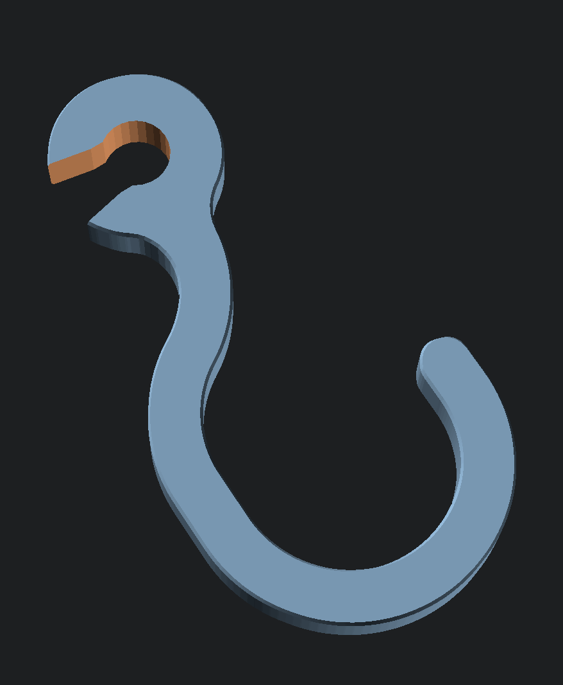
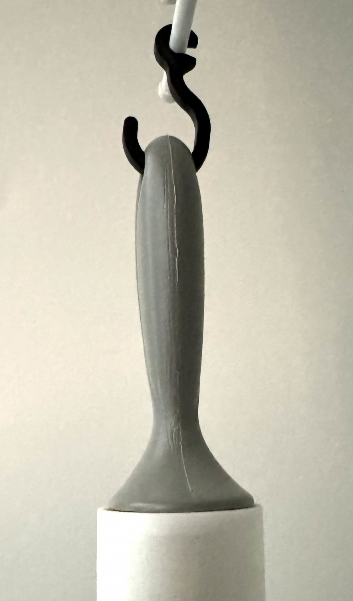

# Handy Wire Shelf Hook

The Handy Wire Shelf Hook is designed to clip onto a wire shelf and hold most light-weight items you may put in a closet, such as umbrellas, lint rollers, and reusable shopping bags.

|||
|-|-|
|||

## Printing

PETG or similar filament is recommended for printing the hook. PLA is not recommended because it loosens more over time when under tension, making it more likely to fail.

## Cloning this Repository

This project uses a submodule for some common SCAD code. If the submodule is not initialized, the `openscad-utilities` directory will be empty, and the project won't render.

To get the submodule code when cloning, add the `--recurse-submodules` option to the clone command. For example:
> `git clone https://github.com/CharlesLenk/scad-export.git --recurse-submodules`

If you've already cloned the project, run this command in the project root to pull down the submodule:
> `git submodule update --init`

## Dimensions

With the default settings, the hook has a 20mm interior radius, a width of 5mm, and clips onto a 6.5mm rod. These values and more can be edited directly in `hook.scad`, or by setting additional parameters in the included export script.

## Exporting

This project can be exported using [OpenSCAD](https://openscad.org/).

To export a large number of hooks with different parameters, [SCAD Export](https://github.com/CharlesLenk/scad-export) can be used. For example, the `export.py` in this repository exports a hook for several wire rod widths, starting at 4mm and ending at 7mm.
